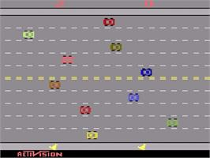

# A black-box approach for average-reward and semi-Markov decision processes

This repository is part of the supplemental material for the paper "A black-box approach for average-reward and semi-Markov decision processes". 

## Access control queuing task
In this experiemnt, we have n=10 servers who gets free with probability 0.06 and customers of priorities {8, 4, 2, 1} with arrival probabilities of {0.4, 0.2, 0.2, 0.2} respectively. The customer at the head of the queue is either assigned to a free server, with a pay-off equal to the customer’s priority or rejected with zero pay-off. Making `accept' the only action for states with priority 8 and any number of free servers, the state with no free servers is recurrent and the unichain condition holds.

**State:** number of free servers and customer's priorities.\
**Actions:** accept or reject a customer. For customers with priority 8, the only available action is to accept them.\
**Reward:** customer's priorities.

Using dynamic programming, we know that the average reward is  

### Requirements

Create a conda environment with the following package:

python >= 3.7\
numpy\
matplotlib\
tqdm\
rpy2

Or through the env1.yml

```setup
conda env create -f env1.yml
```

### Training

Modify the file access_queue_control_nudging.py whether if you want to run optimal or α- nudging:

* _line 140:_ uncomment for optimal nudging
* _line 143:_ uncomment for α- nudging

To train nudging, run this command:

```train
python -i access_queue_control_nudging.py
```

The black box called by nudging is Q-learning. You can set:
* _line 107:_ directory where to save data
* _line 116:_ learning rate for the black-box
* _line 134:_ max number of steps for the black-box
* _line 132:_ max numer of iterations for nudging

### Results

To plot results and compare them with the baselines from state-of-the-art average-reward algorithms, like R-learning, SMART, R-SMART and SSPQ, run this command:

```plot
python plot_results.py
```


The final average-reward approximate by each method is:

|      Method     | Average reward, ρ | \|ρ*-ρ\| |
|:---------------:|:-----------------:|:--------:|
| Optimal Nudging |       3.308       |   0.028  |
| R-learning      |       3.247       |   0.032  |
| SMART           |       3.116       |   0.163  |
| R-SMART         |       3.169       |   0.110  |
| SSPQ            |       3.273       |   0.006  |


## RiverSwim
This experiment similar to the one presented by Strehl and Littman [2008]. The riverswim consists of six states and there are two possible actions: swim left (with the current) or right (against the current of the river). If the agent swims right, there is a probability of 0.6 for the agent to remain in the same state, 0.35 for moving to the right state and 0.05 for moving the left state. However, if the agent swims left, the agent always succed in moving to the left, until the leftmost state which yields a small reward of 0,01. The agent receives a reward of 1,0 for swimming upstream and reaching the rightmost state.

**State**: \
**Actions**: swim left (0), swim right (1)\
**Reward**: \


Evaluating over all policies, we know that the optimal policy is swimming right in every state, with an average reward of  


### Requirements

Create a conda environment with the following package:

python >= 3.7\
numpy\
matplotlib\
tqdm

Or through the env1.yml

```setup
conda env create -f env1.yml
```

### Training

Modify the file nudging_qLearning.py whether if you want to run optimal or α- nudging:

* _line 96:_ uncomment for optimal nudging
* _line 99:_ uncomment for α- nudging

To train nudging, run this command:

```train
python -i nudging_qLearning.py
```

The black box called by nudging is Q-learning. You can set:
* _line 65:_ directory where to save data
* _line 73:_ learning rate for the black-box
* _line 71:_ max number of steps for the black-box
* _line 66:_ max numer of iterations for nudging

If you want to run R-learning:
```train
python -i rlearning.py
```

### Results

To plot results and compare them with the baselines from state-of-the-art average-reward algorithms, like R-learning, run this command:

```plot
python plot_results.py
```


The final average-reward approximate by each method is:

|      Method     | Average reward, ρ  |  \|ρ*-ρ\|  |
|:---------------:|:------------------:|:----------:|
| Optimal Nudging |       0.4281       |   0.00044  |
| R-learning      |       0.4934       |   0.06477  |
| R-SMART         |       0.3438       |   0.08476  |


## Freeway
We use this environment from [OpenAI gym](https://gym.openai.com/envs/Freeway-v0/) to test nudging with a black box with function approximation (DQN implementation from [Stable Baselines](https://stable-baselines.readthedocs.io/en/master/modules/dqn.html)). The task is to run across a ten-lane highway with traffic.

For solving an average reward problem, having a recurrent state and to generate the Bertsekas Split,
we modified the enviroment in the following way:

**State:** RGB image of shape (210, 160, 3)  



**Recurrent state:** the state after the first 500 steps 

**Actions:**
  * 0 - no move
  * 1 - one step forward
  * 2 - one step backwards
The action selected by the agent is executed with a 98% probability 

**Reward:**


The episode ends if it meets any of the following conditions:
  * The agent has crossed the street
  * The agent was hit by a car
  * After 2000 steps, none of the two previous situations have occurred

### Requirements

Create a conda environment with the following package:

python = 3.6\
numpy\
matplotlib\
ternsorflow = 1.15\
pandas\
tqdm\
gym\
atari_py\
opencv

To install the missing ROMs, follow the instructions [here](https://github.com/openai/atari-py#roms)

Or through the env_freeway.yml

```setup
conda env create -f env_freeway.yml
```

### Training

Modify the file train_freeway_nudging.py whether if you want to run optimal or α- nudging:

* _line 48:_ uncomment if not using GPU
* _line 138:_ uncomment for optimal nudging, doing an approximation for solving the left and right uncertainty 
* _line 141:_ uncomment for optimal nudging, computing ρ as in the intersection point of the conic section of the left and right uncertainty
* _line 144:_ uncomment for α- nudging

To train nudging, run this command:

```train
python -i train_freeway_nudging.py
```

The black box called by nudging is DQN. We modified the DQN implementation from [Stable Baselines](https://github.com/hill-a/stable-baselines), to incorporate the new reward definition and 
the recurrent state. You can set:
* _line 92:_ directory where to save data
* _line 117:_ learning rate for the black-box
* _line 122:_ max number of steps for the black-box
* _line 109:_ max numer of iterations for nudging

If you want to run [deep R-learning](https://www.cs.utexas.edu/~pstone/Papers/bib2html/b2hd-IROS20-shah.html):

```train
python -i rlearning.py
```

**Note**: for this project, all trainings were done using a GPU RTX 2080ti. Training optimal nudging can take about 6 hours.

### Testing
For testing the final models for nudging and deep R-learning:

* Place them in the folder ./models
* Modify line 42 of test.py with the name of the model you want to test
* Run the command:

```test
python test.py
```

Also, you can visualize learning curves such as episode reward, loss and TD-loss with Tensorboard.

### Results
Results for optimal and α- nudging, deep R-learning, and discounted DQN in Freeway. Nudging achieves the highest average reward and its estimate is the closest to the ratio of the probability of crossing and the average duration of the episode obtained testing the policy 1000 times.


## Microgrid
We designed a task to test nudging in a general semi-Markov problem with non-unitary costs. The designed microgrid environment has distributed generation (DG), such as gas-fired power plant, solar and wind renewable energy sources, and energy storage device. Our microgrid is connected to the  electric power system and the goal is to find the average-reward for one day operation. The controller agent receives a reward based on the amount of energy from DGs used to supply the demand and if it was able to sell energy to the main grid. The operating cost includes the main grid backup and the generation cost of the gas-fired power plant (all in USD). Also, the agent has information in a continuous state space about the hour, day, month, if the gas plant is enable and its cost of generation and the battery charge percentage. Its action space is continuous as well, controlling the amount of charge/discharge of the battery, activate the gas plant and set its generation between 5-8 MW.


### Continuous state space

|    Variable                | Min Value  | Max Value |    |
|:--------------------------:|:----------:|:---------:|:--:|
| Hour                       |       0    |     23    |    |
| Day                        |       1    |     31    |    |
| Month                      |       1    |     12    |    |
| Gas plant enabled          |       0    |     1     |    |
| Gas plant generation cost  |       0    |     1000  | </a>|
| Battery charge (%)         |       0    |     100   |    |


### Continuous action space

|           Actions          | Min Value  | Max Value |
|:--------------------------:|:----------:|:---------:|
| % battery charge/discharge |     -100   |    100    |
| Enable gas plant           |       0    |     1     |
| Gas plant generation (MWh) |       5    |     8     |

### Reward
\textrm{load}\\&space;0.0&space;&&space;\textrm{otherwise}&space;\end{matrix}\right." title="r(s)=\frac{\textrm{solar gen}+\textrm{wind gen (MWh)}}{\textrm{load (MWh)}} + \left\{\begin{matrix} 1.0 & \textrm{gas gen + renewable gen + battery gen}>\textrm{load}\\ 0.0 & \textrm{otherwise} \end{matrix}\right." /></a>

### Cost
</a>

</a>

</a>

### Requirements

Create a conda environment with the following package:

python = 3.6\
numpy\
matplotlib\
ternsorflow = 1.15\
pandas\
tqdm\
gym\
statsmodels\
stable_baselines\
xlrd

Or through the env_microgrid.yml

```setup
conda env create -f env_microgrid.yml
```

### Training

Modify the file train_microgrid_nudging.py whether if you want to run optimal or α- nudging:

* _line 27:_ uncomment if not using GPU
* _line 122:_ uncomment for optimal nudging, doing an approximation for solving the left and right uncertainty 
* _line 125:_ uncomment for optimal nudging, computing ρ as in the intersection point of the conic section of the left and right uncertainty
* _line 128:_ uncomment for α- nudging
* _line 57:_ directory where to save data
* _line 101:_ learning rate for the black-box
* _line 51:_ max number of steps for the black-box
* _line 54:_ max numer of iterations for nudging

The black box called by nudging is PPO2 implementation from [Stable Baselines](https://github.com/hill-a/stable-baselines). 

To train nudging, run this command:

```train
python -i train_microgrid_nudging.py
```

**Note**: for this project, all trainings were done using a GPU RTX 2080ti. Training optimal nudging can take about 8 hours.

### Testing
For getting the gain, testing the policy multiple times, run:

```test
python test.py
```

### Results
Optimal nudging requires for this scenario four calls to the black box to get a stable gain around ρ=0.073. This results exemplify the ability of nudging to seamlessly extend off-the-shelf deep reinforcement methods to average-reward problems.


## Resources used
All the experiments were run in a server with the following characteristics:
* Processor AMD Ryzen Threadripper 2950X
* Board ASRock X399
* GPU RTX 2080ti
* OS Ubuntu 18.04.5 LTS


## Contributing
We use existing assets, like OpenAI gym and Stable Baselines libraries, which have MIT license. This project is also under the MIT License.
